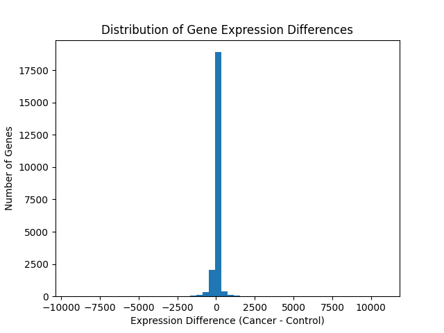

# bioinformatics-projects
A collection of bioinformatics projects focusing on genomic data analysis, including gene expression analysis, data processing, and visualization using Python/R.

## Project 1: Gene Expression Analysis of Breast Tissue

### Overview
This project analyzes gene expression differences between normal breast tissue and breast cancer samples using a public dataset from GEO (GSE20437).

### Objective
Identify genes that are differentially expressed between control and cancer samples.

### Methods
- Loaded and processed gene expression data
- Defined control vs cancer sample groups
- Calculated mean expression for each group
- Computed expression differences
- Identified top upregulated and downregulated genes
- Visualized distribution of expression differences

### Results

We compared gene expression between control and breast cancer samples.

- Identified genes with large expression differences between conditions
- Observed that most genes show minimal change, with a subset showing strong up/down regulation

#### Top Upregulated Genes (Higher in Cancer)
The following genes showed the largest increase in expression in cancer samples compared to controls:

- 221798_x_at  
- 202649_x_at  
- 203107_x_at  
- 211073_x_at  
- 201033_x_at  

#### Top Downregulated Genes (Lower in Cancer)
The following genes showed the largest decrease in expression in cancer samples:

- 202081_at  
- 202672_s_at  
- 201694_s_at  
- 200797_s_at  
- 211986_at  

These genes represent the most extreme expression differences between control and cancer conditions, suggesting potential biological relevance.

#### Visualization

The distribution of gene expression differences shows that most genes cluster near zero, with some exhibiting strong differential expression. 

### Tools Used
- Python
- pandas
- matplotlib

### Dataset
- GEO accession: GSE20437